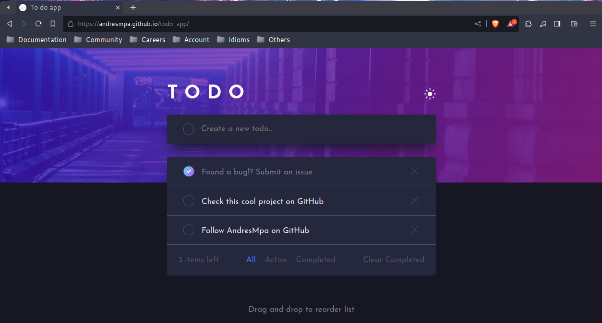

# T O D O

## Table of contents

- [Overview](#overview)
  - [Features](#Features)
  - [Screenshot](#screenshot)
  - [Links](#links)
- [Construction](#Construction)
  - [Built with](#built-with)
  - [Useful resources](#useful-resources)
- [Author](#author)

## Overview

### Features

Users should be able to:

- View the optimal layout for the app depending on their device's screen size
- See hover states for all interactive elements on the page
- Add new todos to the list
- Mark todos as complete
- Delete todos from the list
- Filter by all/active/complete todos
- Clear all completed todos
- Toggle light and dark mode
- **Bonus**: Drag and drop to reorder items on the list

### Screenshot

### Links

- Homepage: [GitHub](https://github.com/AndresMpa/todo-app)
- Live Site: [Last deploy](https://andresmpa.github.io/todo-app/)

## Construction

### Built with

- Semantic HTML5 markup
- [Stylus CSS](https://stylus-lang.com/)
- Flexbox
- Mobile-first workflow

### Useful resources

- [Drag and drop API](https://developer.mozilla.org/en-US/docs/Web/API/HTML_Drag_and_Drop_API) - Drag and drop (Nothing else to say)
- [MIME_types/Common_types](https://developer.mozilla.org/es/docs/Web/HTTP/Basics_of_HTTP/MIME_types/Common_types) - That was useful to achieve drag and drop feature
- [stylus/discussions/2823](https://github.com/stylus/stylus/discussions/2823) - Useful for dark-white native theme with stylus.
- [How to Center Anything with CSS - Align a Div, Text, and More](https://www.freecodecamp.org/news/how-to-center-anything-with-css-align-a-div-text-and-more/) - Thanks god Krish exists, this blog help a lot.

## Author

- GitHub - [@AndresMpa](https://github.com/AndresMpa)
- Frontend Mentor - [@AndresMpa](https://www.frontendmentor.io/profile/AndresMpa)
- LinkedIn - [Andres M. Prieto](https://www.linkedin.com/in/andresmpa/)
